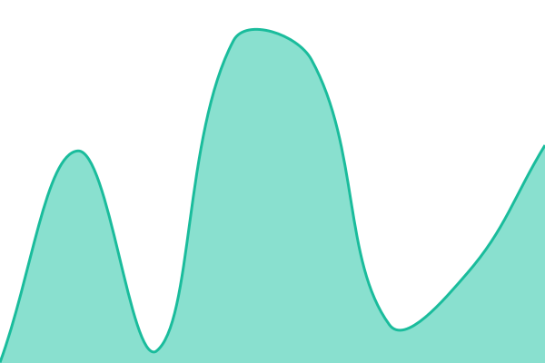
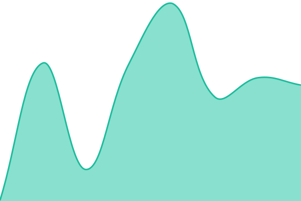

# [📈 Live Status](https://tom_ss@bayezon.ai.github.io/status): <!--live status--> **🟧 Partial outage**

This repository contains the open-source uptime monitor and status page for [tom_ss@bayezon.ai](https://tom_ss@bayezon.ai.github.io/status), powered by [Upptime](https://github.com/upptime/upptime).

With [Upptime](https://upptime.js.org), you can get your own unlimited and free uptime monitor and status page, powered entirely by a GitHub repository. We use [Issues](https://github.com/tom_ss@bayezon.ai/status/issues) as incident reports, [Actions](https://github.com/tom_ss@bayezon.ai/status/actions) as uptime monitors, and [Pages](https://tom_ss@bayezon.ai.github.io/status) for the status page.

<!--start: status pages-->
<!-- This summary is generated by Upptime (https://github.com/upptime/upptime) -->
<!-- Do not edit this manually, your changes will be overwritten -->
<!-- prettier-ignore -->
| URL | Status | History | Response Time | Uptime |
| --- | ------ | ------- | ------------- | ------ |
|  [CityBeach Storefront Loader](https://prod-sunny.bayezon.ai/loader.js) | 🟩 Up | [city-beach-storefront-loader.yml](https://github.com/tomssbayezon/bayezon-status/commits/HEAD/history/city-beach-storefront-loader.yml) | 

 149ms
     
 | 

<a href="https://tom_ss@bayezon.ai.github.io/bayezon-status/history/city-beach-storefront-loader">100.00%</a>
    

|  [Rodd & Gunn Storefront Loader](https://roddandgunn-product-loader.bayezon.com/loader.js) | 🟩 Up | [rodd-and-gunn-storefront-loader.yml](https://github.com/tomssbayezon/bayezon-status/commits/HEAD/history/rodd-and-gunn-storefront-loader.yml) | 

 163ms
     
 | 

<a href="https://tom_ss@bayezon.ai.github.io/bayezon-status/history/rodd-and-gunn-storefront-loader">100.00%</a>
    

|  [Rodd & Gunn Failing Loader](https://roddandgunn-loader.bayezon.com/loader.js) | 🟥 Down | [rodd-and-gunn-failing-loader.yml](https://github.com/tomssbayezon/bayezon-status/commits/HEAD/history/rodd-and-gunn-failing-loader.yml) | 

 0ms
     
 | 

<a href="https://tom_ss@bayezon.ai.github.io/bayezon-status/history/rodd-and-gunn-failing-loader">4.54%</a>
    

<!--end: status pages-->

[**Visit our status website →**](https://tom_ss@bayezon.ai.github.io/status)

## 📄 License

- Powered by: [Upptime](https://github.com/upptime/upptime)
- Code: [MIT](./LICENSE) © [Anand Chowdhary](https://anandchowdhary.com)
- Data in the `./history` directory: [Open Database License](https://opendatacommons.org/licenses/odbl/1-0/)
